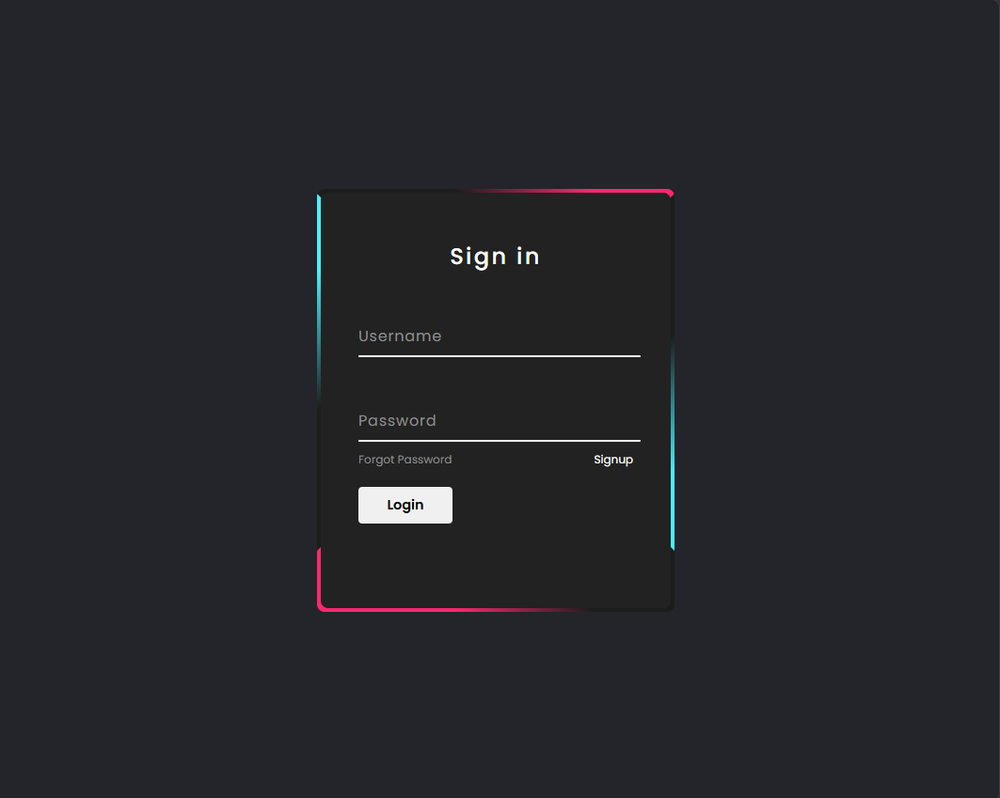
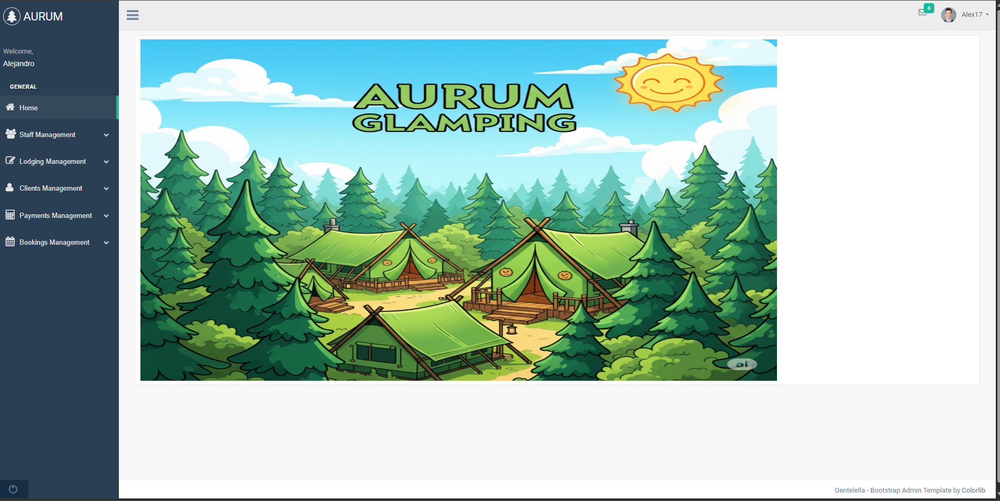
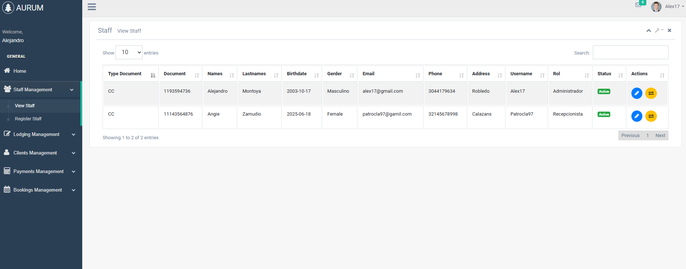
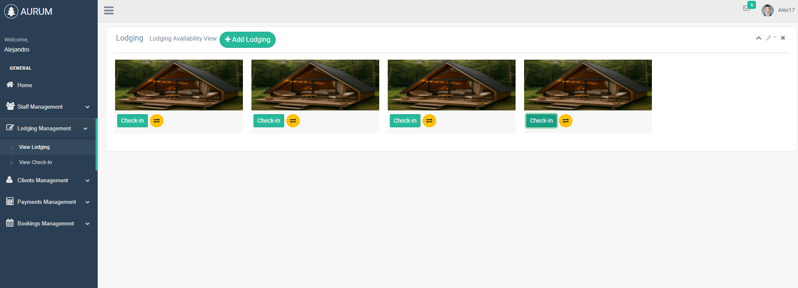
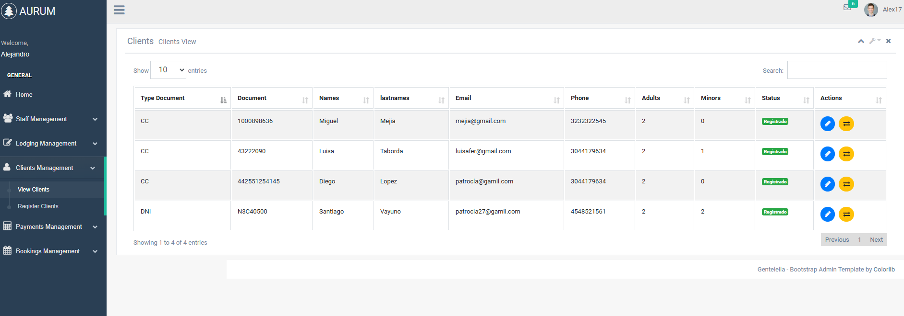
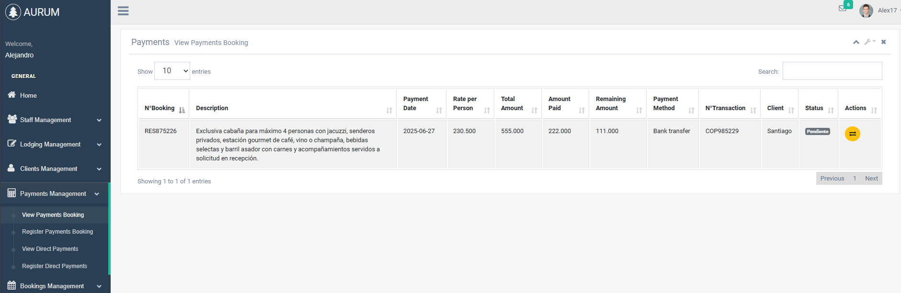
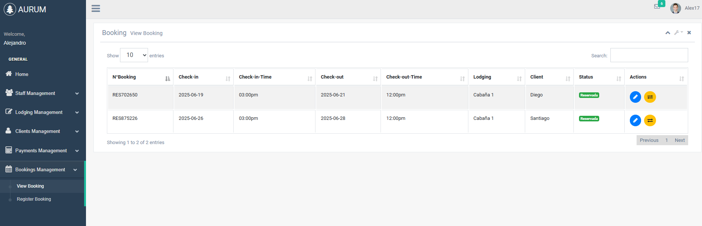

# AURUMGF - Sistema de Gestión para Glamping










Sistema web administrativo desarrollado para la gestión de un negocio de alojamiento, utilizando PHP y una arquitectura MVC.

El sistema permite administrar diferentes áreas relacionadas con la operación del establecimiento, incluyendo alojamientos, clientes, pagos, reservas y usuarios del sistema.

## 📌 Descripción

AURUMGF es una aplicación web desarrollada utilizando PHP bajo una arquitectura MVC (Model-View-Controller).

El sistema fue diseñado para centralizar diferentes procesos administrativos y facilitar la gestión de la operación del negocio desde una interfaz web.

La aplicación cuenta con diferentes módulos para la administración de usuarios, alojamientos, clientes, pagos y reservas.

## 🚀 Características

### 👥 Gestión de personal

Módulo destinado a la administración del personal y usuarios que utilizan el sistema.

- Gestión de usuarios.
- Administración del personal.
- Control de acceso al sistema.

### 🏠 Gestión de alojamientos

Permite administrar la información relacionada con los alojamientos disponibles.

- Gestión de alojamientos.
- Administración de la información de hospedaje.
- Control de los alojamientos registrados.

### 👤 Gestión de clientes

Módulo destinado a la administración de los clientes del establecimiento.

- Registro de clientes.
- Consulta de clientes.
- Administración de información de clientes.

### 💳 Gestión de pagos

Permite administrar la información relacionada con los pagos realizados dentro del sistema.

- Gestión de pagos.
- Registro de pagos.
- Administración de pagos relacionados con las reservas.

### 📅 Gestión de reservas

Módulo principal para la administración de las reservas.

- Gestión de reservas.
- Administración de reservas de alojamiento.
- Gestión de información relacionada con las reservas.

## 🛠️ Tecnologías utilizadas

- PHP
- HTML5
- CSS3
- JavaScript
- Arquitectura MVC
- SQL
- Apache
- Git
- GitHub

## 🏗️ Arquitectura del proyecto

El proyecto utiliza el patrón de arquitectura **MVC (Model-View-Controller)**, separando la lógica de la aplicación, los datos y la interfaz de usuario.

### Model

Contiene los modelos encargados de trabajar con los datos de la aplicación.

```text
application/
└── model/
    ├── mdlBooking.php
    ├── mdlCheckin.php
    ├── mdlClients.php
    ├── mdlLodging.php
    ├── mdlPaymentsBooking.php
    ├── mdlPaymentsDirect.php
    ├── mdlUser.php
    └── model.php
```
### View

Contiene las interfaces que interactúan con el usuario.

```text
application/
└── view/
    ├── _templates/
    ├── Booking/
    ├── Clients/
    ├── home/
    ├── Lodging/
    ├── Lodging/
    ├── Payments/
    ├── problem/
    └── Users/
```

### Controller

Contiene los controladores encargados de gestionar las solicitudes y coordinar la lógica de la aplicación.

```text
application/
└── controller/
    ├── bookingController.php
    ├── checkinController.php
    ├── clientController.php
    ├── home.php
    ├── lodgingController.php
    ├── paymentsBookingController.php
    ├── paymentsDirectController.php
    ├── problem.php
    └── userController.php
```
## 📁 Estructura del proyecto

```text
AURUMGF/
├── application/
│   ├── config/
│   ├── controller/
│   ├── core/
│   ├── libs/
│   ├── model/
│   └── view/
├── public/
├── .gitignore
├── .htaccess
└── crud.sql
```

## 🎯 Objetivo

Desarrollar un sistema web administrativo que permita centralizar y facilitar la gestión de las principales operaciones de un negocio de alojamiento.

El proyecto busca aplicar conceptos de desarrollo web, arquitectura MVC, manejo de bases de datos y organización modular del código.

## 📚 Arquitectura MVC

El proyecto fue desarrollado aplicando el patrón Model-View-Controller, permitiendo separar las responsabilidades de la aplicación:
- Model: gestión y acceso a los datos.
- View: presentación e interfaz del sistema.
- Controller: procesamiento de solicitudes y lógica de aplicación.
Esta separación permite mantener una estructura organizada y facilitar el mantenimiento y evolución del proyecto.

## 🔄 Evolución del proyecto
AURUMGF cuenta con diferentes versiones de desarrollo.

AURUMGF 1.0

PHP + MVC

Primera versión del sistema desarrollada utilizando PHP y una arquitectura MVC.

AURUMGF 2.0

Laravel + Blade + Tailwind CSS + Vite

Evolución del proyecto hacia Laravel, incorporando nuevas funcionalidades, autenticación, un panel administrativo renovado y un sitio web público.

## 👨‍💻 Autor

**Alejandro Montoya**

Desarrollador de Software Junior | Backend

Con conocimientos en desarrollo web, bases de datos, desarrollo backend y tecnologías frontend.

